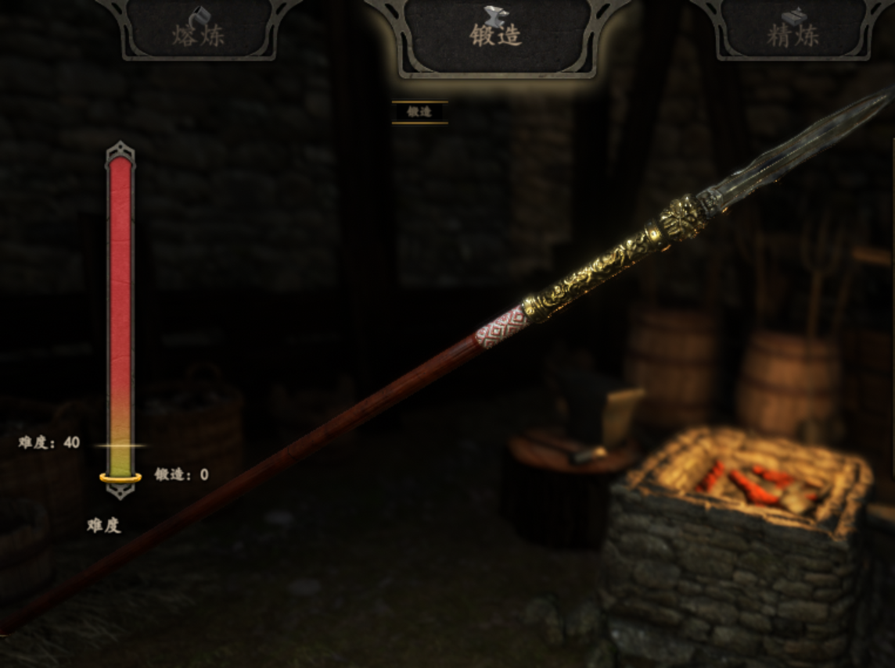

# 衣谷作坊 - 虎头枪 Mod

[English](README.md) | [中文版](README_CN.md)

## 介绍

这是 [骑马与砍杀2: 霸主](https://www.taleworlds.com/en/Games/Bannerlord) 的一个武器 Mod。这个 Mod 启用后，将在你的背包中添加一个非常强力的 **虎头枪**。只要玩家的装备和背包中没有虎头枪，则会自动添加一个。

## 开始使用

1. 下载本 Mod 到你的 `Mount & Blade II Bannerlord/Modules` 目录下。
2. 开启游戏并且选中 `TigerHeadQiang` Mod。
3. 如果你开启一个新的存档，那么保存并重新加载后，便可在背包中看到这个武器。

## 协议

Copyright © 2020 衣谷作坊 版权所有。

 本作品采用<a rel="license" href="http://creativecommons.org/licenses/by-nc-sa/4.0/">知识共享署名-非商业性使用-相同方式共享 4.0 国际许可协议</a>进行许可。

以下是该协议的简单总结：

## 贡献

感谢你的关注！请在本 Repo 中提出 Issue 或者是 Pull Requests。
